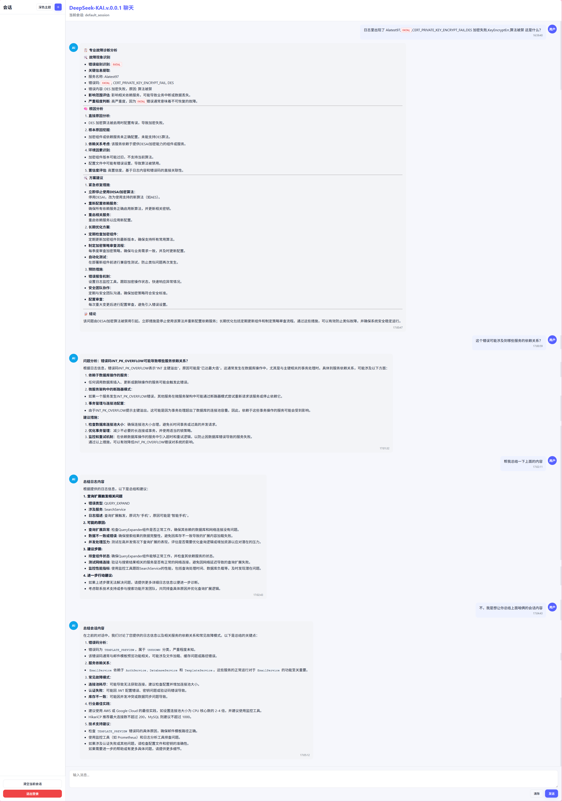

# 项目日志
## 25/10/20 
17:30 跑通项目原始代码并提交，无修改

20:00 完成前端显示优化，实现Markdown与代码高亮渲染、错误日志级别高亮、响应式布局优化、明/暗主题一键切换，总结在IDA/frontend/vue_frontend/FRONTEND_DISPLAY_IMPROVEMENTS.md文件

## 25/10/21
0:25 完成Prompt和RAG改进，实现基础Prompt重构、专家领域知识库构建、上下文检索等优化，但前端显示过于单一，尚需优化。

17:30 初步完成除COT以外的所有优化方向，经多轮对话测试，响应速度、回复内容等均表现较好。

